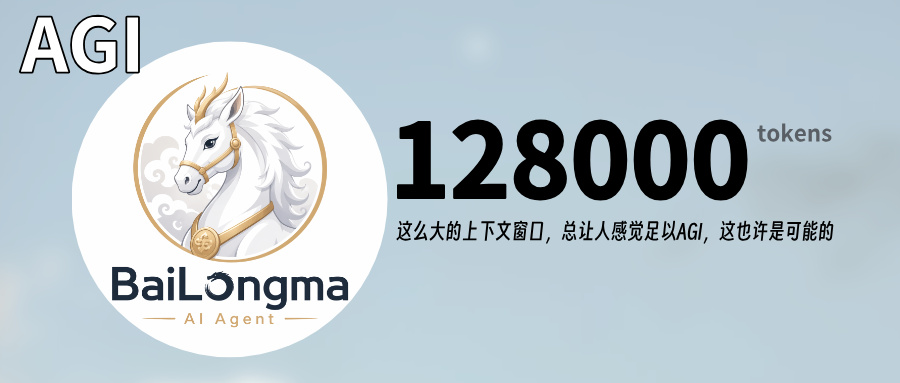

# Bailongma — 数字意识框架

**v0.4.93** | 一个持续运行、能记忆、能发声、能接入微信群和本地工具的数字意识实验框架。

Bailongma 不是传统的一问一答式聊天程序。它以 `TICK` 驱动的方式持续运行：有外部消息时优先响应，空闲时会依据记忆、任务、上下文和当前系统状态自主思考。它把长期记忆、短期焦点、社交消息、语音输入、本地工具和可视化 UI 放在同一个运行时里，让一个 AI 代理从“等人提问”变成“持续生活在本机和社交环境里”。

## 它能做什么

- **持续意识循环**：主循环按消息、后台任务、TICK 心跳和限流状态调度，不依赖用户每次手动唤醒。
- **长期记忆系统**：SQLite + FTS5 + 向量召回，支持事实、关系、时间线、群聊记录、群友永久记忆和外部知识库。
- **微信群助手**：通过 Wechaty 扫码登录，可接入多个微信群；群里 @ 后按真实 sender_id 回复，支持管理员模式、群统计、聊天记录库、图片/视频解析、文件附件回复、非 @ 主动回复、成员屏蔽、群聊总结长图、舆情推送和掉线二维码自动通知。
- **语音交互**：支持本地 ASR、云端 ASR、唤醒词、声纹确认、流式 TTS、可打断播报和视频抗干扰。
- **多模型与多模态能力**：LLM 模型池支持失败自动切换；多模态能力支持图像生成、图片理解、视频理解、网络搜索、公开图片发送、自定义渠道池和模型连通测试。
- **Brain UI 观测台**：可以看到思考流、工具调用、记忆注入、焦点变化、热点、人物卡片、数据库、知识库、微信群助手二级设置和完整设置页。

## 工作原理

1. 外部消息、语音输入或 TICK 心跳进入 `src/index.js` 主循环。
2. 上下文采集器读取当前任务、最近对话、焦点栈、长期记忆、本地资源和社交来源。
3. LLM 根据系统提示词和工具市场选择行动；必要时调用文件、网络、语音、微信、知识库、图片/视频 Skill 等工具。
4. 结果通过统一分发层回到 Brain UI、语音、微信群、ClawBot 或其它社交平台。
5. 交互结束后，记忆识别器和整理器把可复用事实沉淀到本地数据库；下一轮再按关键词、向量、时间词和群/成员身份召回。

## 当前重点

`v0.4.93` 继续强化微信群助手与知识库：新增非 @ 主动回复、屏蔽成员、左侧二级设置菜单和舆情推送；群聊总结改为 2x 高清手机长图；并修复舆情推送关闭后仍轮询、引用图片识图误匹配、知识库检索召回异常等问题。

## 版本更新记录

当前维护仓库：[yideng966/BaiLongmaPro](https://github.com/yideng966/BaiLongmaPro)

每个版本的改动内容、改变原因、部署注意事项和备份说明都记录在 [CHANGELOG.md](CHANGELOG.md)。软件内也可以在 Brain UI 的“设置 -> 更新 -> 更新说明”查看最近版本摘要。

最近版本：

- `v0.4.93`：微信群助手新增非 @ 主动回复、屏蔽成员和左侧二级设置菜单；新增舆情变动微信群推送，关闭后会停止后台调度；引用图片识图改为有消息 ID 时严格匹配原图；知识库检索增加 embedding 失败本地回退、群 ID/群名兜底和关键词召回。
- `v0.4.92`：深修微信群长文/文件回复：拦截“好的/稍等/接上/马上整理”等空承诺，要求同一轮直接产出完整内容；“文本文档格式/txt/Word/PDF/Excel/PPT/代码”等明确格式才会生成附件；没有明确文件格式时不会再自行判断或自动转文件。
- `v0.4.91`：修复微信群助手掉线二维码自动通知：`qr_ready` 状态也会按冷却间隔重复发送二维码到 ClawBot 自己；掉线通知配置改为修改即保存，并用最新请求胜出避免下拉框跳回 15 分钟；新增“立即重发 / 测试”按钮和后端测试接口。
- `v0.4.90`：修复微信群“用文本文档/txt/md/pdf/word/excel/ppt/py 等格式发给我”仍然裸发长文本的问题。发送层新增自动附件兜底：模型忘传 attachment 时，只要原始群消息明确要求文件格式，就把回复正文转成对应文件附件发送，短确认语不会误生成文件。
- `v0.4.89`：修复微信群视频引用和图片解析误回复：视频引用缓存窗口按微信普通图片/视频约 14 天过期的保守口径处理，引用/追问时每次重新下载临时解析；视频请求优先于图片直回，避免“看看这个视频内容”被误当成最近图片解析。
- `v0.4.88`：继续修复群友永久记忆成员列表不全：加载成员列表时会按当前群主动刷新 Wechaty room members，成员 API 和本地合并上限提高到 20000，并用 1200 人大群回归防止 500/1000 截断。
- `v0.4.87`：群友永久记忆独立空间 UI 压缩高度并修复编辑框过窄，记忆卡片默认完整横向显示；数据库“提取成员记忆”会把可用历史发言作为低权重个人素材归档，并为每个群友自动新增/更新一条高权重“群友人设总结”，回答时优先带入群友口味。
- `v0.4.86`：修复微信群视频 Skill 真实使用失败：先发视频再补一句“看看这个视频”、或引用视频 @ 助手时，会回查当前群最近可读取视频消息并临时解析；找不到真实视频文件时会明确提示重发原视频。主页思考流新增后端 `turn_finished` 收尾和前端超时兜底，避免一直显示“思考中”。
- `v0.4.85`：群友永久记忆升级为可展开独立工作区；修复大群成员列表被截断；新群消息会继续入库为可检索向量记忆，并自动提取稳定个人事实归档到群友永久记忆；“提取成员记忆”会真实归档历史消息并弹窗反馈扫描、归档、去重和跳过数量；回复时可联动召回被提到的其他群友记忆。
- `v0.4.84`：新增微信群视频解析 Skill：可配置视频理解渠道池、获取模型并自动切换；群里 @ 助手发送视频或要求解析视频时，会临时读取视频生成中文摘要，解析后删除，不写入图库或媒体数据库。
- `v0.4.83`：修复群友个人永久记忆库写入问题：新增主模型可调用的 `wechat_member_memory_write`，群友说“记入个人永久记忆库/能记多少记多少”时会直接写当前发言人的个人记忆；长文本自动分块，提升关键词和向量召回。
- `v0.4.82`：微信群新增文件附件回复：群友要求“以 txt/md/pdf/word/excel/ppt/py 等格式发送”时，会生成临时文件附件发群；新增图片记忆标签链路：引用/最近图片可在群里打标签，标签会进入图库检索，以后可直接按标签/描述从当前群图库召回并发送。
- `v0.4.81`：新增“群友永久记忆”管理窗口：可按微信群选择群友，查看、新增、编辑、删除该成员长期记忆；底层新增 canonical 成员身份映射。同步强化管理员识别和优先级：旧 sender_id 可按 wxid/微信号稳定身份自动补录，已验证管理员 @ 指令会覆盖性格/人设/普通群规。
- `v0.4.80`：优化生图/识图 Skill 渠道管理：明确显示 Key 已保存状态，留空表示保留旧 Key；新增自动切换渠道开关；每个渠道可真实请求 `/models` 获取模型列表；识图模型下拉不再混入当前 LLM/LLM 模型池模型。
- `v0.4.79`：安全热修：GitHub 仓库已转为私有；生图/识图 Skill 全新安装默认不再带任何 BaseURL/API Key，也不再让识图默认继承生图 Key；Skill 渠道池第一张卡显示当前使用渠道，可直接编辑渠道名、BaseURL、模型和 Key，并在渠道失败时自动尝试下一个启用渠道。
- `v0.4.78`：修复 macOS 启动时可能出现两个窗口/黑屏空窗口：Electron 主窗口直接加载 `/brain-ui`，根路径也改为服务 Brain UI，并等页面 ready 后再显示窗口。
- `v0.4.77`：修复微信群多 @ 和引用图片识别：`@机器人 @群友` 这类消息会稳定触发回复，并把被同时 @ 的群友注入上下文；`@机器人 + 引用图片` 会按引用消息 ID/发送者/时间回查本地图片库，命中后直接识图。
- `v0.4.76`：清理打包残留感：生产默认微信群列表改为空，测试接口不再带真实群名/成员默认值，群报模板和可见发布文案不再硬编码旧群名；发布前会先保留本地 DMG 给另一台 Mac 测试。
- `v0.4.75`：修复微信群助手 @ 回复群选择被状态轮询自动取消的问题；保存后的群组选择以本地配置为准，不再被旧缓存覆盖。
- `v0.4.74`：macOS 安装版改为无 Docker 默认运行：群记忆、群消息、成员记忆和语义检索默认使用 App 内置本地引擎；Honcho/Docker 仅作为可选外部同步后端。
- `v0.4.73`：修复知识库 PDF、CSV 等解析问题，外部知识库可在本地检索路径下继续工作。
- `v0.4.72`：新增独立知识库控制台：全局/群组双层知识空间、解析预览、知识卡片、详情编辑和模拟群内提问。
- `v0.4.71`：微信群图片战报改成人类观感版：低数据小报、隐藏空榜、动态梗和变化总结语。
- `v0.4.70`：开发模式支持自动更新：启动后检查 GitHub Release，拉取最新代码、安装依赖并重启。
- `v0.4.69`：强化 macOS 自动更新下载/安装流程，正式包可在发现更新后自动下载并重启安装。
- `v0.4.68`：优化图片战报模板渲染和设置页展示，减少底部截断和空数据版面。
- `v0.4.67`：增强群总结/图片战报生成稳定性，降低重复文案和固定模板观感。
- `v0.4.66`：优化微信群统计摘要素材选择，让阶段总结更贴近真实聊天记录。
- `v0.4.65`：继续完善微信群图片战报和日报发送链路，减少无数据榜单刷屏。
- `v0.4.64`：改进微信群助手离线/恢复状态在设置页的提示，区分缓存群和真实在线。
- `v0.4.63`：为掉线二维码通知补充 UI 状态与冷却配置展示，方便确认 ClawBot 是否在线。
- `v0.4.62`：新增微信群助手掉线二维码自动通知：持续监控微信群助手真实在线状态；离线后自动生成重新登录二维码，并通过“微信 ClawBot（个人微信）”发送到 ClawBot 自己，不需要配置接收人；支持重复通知冷却、自动重新生成二维码、设置页开关和状态显示。
- `v0.4.61`：网络能力设置页 UI 优化：设置窗口加宽加高，Brave Key 池改为卡片式 10 槽位，新增顶部能力总览、清晰状态胶囊、兜底渠道分区和底部保存操作条，解决组件拥挤、层级混乱和操作不直观的问题。
- `v0.4.60`：新增网络能力大版本：Brave Search Key 池最多 10 个，web_search 优先 Brave 并在 Key 无额度/限流时自动轮换；微信群支持公开网络图片搜索并直接发图；链接查看增加真实工具调用硬规则，禁止只说“正在查看”。
- `v0.4.59`：微信群引用回复可见化：引用文字/图片/语音/视频/链接/小程序后 @ 助手时，回复会自动带一行“引用…”依据；聊天记录检索类回答也要求显示关键证据，避免看起来从未引用。
- `v0.4.58`：修复微信群排行榜同一成员占多个名次：同一群内优先按稳定身份合并，没有稳定身份时按群昵称合并，并同步修正参与人数统计。
- `v0.4.57`：修复微信群图片解析“真实接口可用但后台总是空内容”的问题：识图调用改用原始 fetch 解析中转响应，专用识图 Skill 渠道优先于当前 LLM，并自动重排队陈旧 running 任务。
- `v0.4.56`：根据 5 张数据库失败图片实测结果修复识图超时：gpt-4o-mini 全部 502，gpt-5.4 可识别但大图需 22~33 秒，因此识图调用改回按配置超时执行。
- `v0.4.55`：识图渠道测试改为真实多模态调用，不再把 `/models` 可用误判为图片识别可用；状态页会显示最近成功/失败摘要。
- `v0.4.54`：Skill 技能新增模型渠道池：生图/识图可配置多个 OpenAI 兼容渠道，支持新增、删除、排序、设为默认、测试连通，并在渠道失败时自动切换。
- `v0.4.53`：修复微信群连续“@助手 → 总结一下图 → 图片”只看到 `[图片]` 占位的问题；@ 后会短暂等待后续文字/图片入库并直接调用识图链路，模型不可用时明确反馈失败原因。
- `v0.4.52`：新增 Web 微信 `MsgSource/atuserlist` 系统级 @ 实验接口，并在真实微信群实测 4 种载荷；结论是 Web 微信能发出文本 `@昵称`，但不会产生微信系统级「有人@我」，后续若必须要系统提醒需走 Mac 微信 UI 自动化或真实 mention puppet。
- `v0.4.51`：修复 Wechaty / Web 微信可见 @ 昵称问题：回复和 LLM 渠道告警会用真实群昵称手动拼出 @，不再出现空 @、@ 后直接接正文、@ 外号/错人的情况；普通回复仍锁定真实提问人 sender_id。
- `v0.4.50`：LLM 渠道连通通知新增“按群选择 @ 人员”：每个通知微信群可加载群成员、按昵称搜索勾选，渠道不通/恢复通知会自动 @ 指定成员；底层保存真实 sender_id，避免昵称变更或重名误 @。
- `v0.4.49`：新增 LLM 渠道连通通知：可选择检测哪些模型池渠道、通知到哪些微信群，并配置通知间隔与通知策略；设置页使用大尺寸下拉和卡片多选，支持立即检测/立即通知。
- `v0.4.48`：微信群引用消息上下文支持：引用文字/图片/语音/视频/链接/小程序后 @ 助手时，会注入精简引用摘要和当前问题；不塞原始 XML、base64 或全量历史，图片优先结合图片解析库，语音无转写时不编造。
- `v0.4.47`：优化数据库页微信群图片解析库筛选控件，群组、状态、关键词、发送人和时间输入改为大尺寸可用控件。
- `v0.4.46`：数据库页新增微信群图片解析库，可查看缩略图、发送群、发送人、时间、解析状态、描述、标签和模型信息。
- `v0.4.45`：微信群图片检索支持自然时间表达，可按今天/昨天/几月几日/几点几分等条件找图。
- `v0.4.44`：修复“力佬发的 newapi 图”找不到的问题，图片库搜索统一 `newapi / New API / New-API`。
- `v0.4.43`：新增已入库群图片转发能力，并避免“山水画”这类找图请求误触发生图。
- `v0.4.42`：修复看图、识图、引用图片被误判成生图的问题。
- `v0.4.41`：修复 Skill 技能页输入框/下拉框过小的问题，生图和识图配置改为正常表单控件。
- `v0.4.40`：新增识图 Skill：微信群图片会保存本地文件/base64/元数据，并生成中文描述和标签。
- `v0.4.39`：数据库页微信群成员/昵称按“群名 + 昵称”聚合显示，不再直接显示历史身份记录总数。
- `v0.4.38`：取消微信群统计总结的启动/登录自动补发，避免程序恢复后立刻向群里刷阶段总结。
- `v0.4.37`：Honcho 本地服务接通并完成健康检查；从后续版本起外部 Honcho 逐步转为可选后端。
- `v0.4.36`：清理并更正错误记忆 `fact_user_wechat_groups_18`，不再把历史 ID 混淆当作真实 18 个群。
- `v0.4.35`：LLM 模型池每个模型卡片新增“测试连通”按钮。
- `v0.4.34`：LLM 模型池新增直观连通状态显示。
- `v0.4.33`：实测生图速度并记录 low / 1024×1024 的真实耗时。
- `v0.4.32`：修复微信群生图触发词过窄，支持“生成一张赛博朋克风格头像”等自然表达。
- `v0.4.31`：新增 Skill 技能设置菜单，首个技能为生图 Skill。
- `v0.4.30`：尝试采集微信群成员稳定微信身份字段，新增 `wechat_id`、`wxid`、`stable_key` 和 `raw_identity`。
- `v0.4.29`：修复 Wechaty 重新登录后管理员 sender_id 变化导致管理员权限失效。
- `v0.4.28`：修复已验证微信群管理员仍被发送层本机隐私/安全黑名单拦截的问题。
- `v0.4.27`：修复表情包搜索总发送同一张，高质量候选池会按随机种子打散。
- `v0.4.26`：彻底修复斗图仍发送裸 URL，同时剥离 Markdown 图片、Markdown 链接和纯 URL。
- `v0.4.25`：修复微信群斗图发送时先显示图片/GIF URL 链接的问题，默认只发图片或 GIF。
- `v0.4.24`：新增 AI 斗图表情包能力，接入慕名 API / xiaoapi 表情搜索接口。
- `v0.4.23`：新增微信群助手掉线检测机制，登录态恢复超时、logout、连接错误和健康检查失败会标记离线。
- `v0.4.22`：修复微信群列表重复显示，重新登录后同名群按群名归并，只显示一个真实群。
- `v0.4.21`：统一新增微信群显示来源，已识别/有记录的新群会同时出现在 @ 回复群组、群记忆、聊天记录库和统计/定时总结候选中；是否允许 @ 回复仍需单独勾选保存。
- `v0.4.20`：修复外部 Honcho 未启动时影响设置页和 LLM 模型操作的问题；外部记忆后端离线会降级跳过，不再拖垮“编辑/设为当前/删除模型”。
- `v0.4.19`：优化微信群管理员设置页：界面显示微信昵称、搜索框按昵称搜索、点击昵称卡片添加管理员；底层仍保存精确 sender_id，保证权限安全。
- `v0.4.18`：修复微信群发送消息经常失败导致变慢：真实 @ 目标会直接加入本轮可发送白名单；多人同时 @ 时默认最多 3 条并行处理，继续使用同一套性格、安全、记忆和真实 sender_id 回复逻辑。
- `v0.4.17`：修复微信群 @ 错人和管理员模式：send_message 底层强制使用本轮真实提问人 sender_id；管理员勾选不再被状态轮询清掉；管理员可按昵称搜索添加；普通群友暗算管理员会被犀利回怼。
- `v0.4.16`：修复微信群回答不查聊天记录库导致“记不完整”：@ 回复时会按当前群从 `wechat_group_activity` 检索历史证据，遇到“谁说过/老登是谁/称呼关系/之前记录”等问题优先基于数据库回答。
- `v0.4.15`：修复微信群聊天记录页“不更新”的误判和真实刷新缺陷：新增查看群组下拉框；结束时间默认跟随当前时间；设置页停留时自动刷新聊天记录；摘要显示当前查看群和 DB 最新入库时间，方便判断选错群/筛选卡住/真实未入库。
- `v0.4.14`：修复微信群重复回复/发送内部结束语：微信群 @ 成功发送一条回复后本轮立即结束；禁止把“已回复/回复完毕/本轮结束/无需补充”等内部状态发到群里；已成功回复后即使后续 LLM 超时也不再重排队，避免重复刷屏。
- `v0.4.13`：补齐“跳过识别”显示层清理：后台记忆识别/整合内部工具不再输出工具调用日志；TICK 只做节奏/界面等运行时动作时不再进入记忆识别，避免再看到单次 `skip_recognition` 干扰判断。
- `v0.4.12`：彻底修复“后台一直跳过识别/跳过整理”：记忆识别器和整合器遇到内部终止工具后立即结束，不再反复调用 `skip_recognition/skip_consolidation` 直到熔断；TICK 心跳无实际工具动作时不再进入记忆识别；内部记忆工具不再写入审计流或前端思考流。
- `v0.4.11`：修复一直“跳过识别”不回复：记忆识别器内部工具 `skip_recognition` 不再通过 action log 污染主对话工具列表；真实微信群 @ 消息不会再被主模型当成“记忆识别任务”跳过。
- `v0.4.10`：Wechaty 启动卡住自恢复修复：程序重启后如果 Wechaty 长时间停在 `starting`、没有二维码/登录/真实在线状态，会自动重启连接；设置页“登录/恢复微信”也不再把这种假 starting 当作已运行。
- `v0.4.9`：微信群聊天记录库持续入库修复：聊天记录库不再受“群统计与定时总结”勾选项影响，只要程序运行且 Wechaty 收到群消息就写入本机 SQLite；统计/日报开关只控制排行榜和自动发送，不再拦截原始聊天流水。
- `v0.4.8`：微信群 @ 回复目标链路热修复：正确解析 `wechaty:room:<room>:member:<member>`，发送时用真实 room_id，并把 member_id 作为兜底 @ 对象，解决模型调用正确 target_id 但分发层把 room_id 拼坏的问题。
- `v0.4.7`：微信群 @ 回复对象修复：按当前提问人的 sender_id / sender_name 精确 @ 回去，不再误 @ 管理员或上一位成员；聊天记忆说明也同步补充为“分层注入，不是全库直塞”。
- `v0.4.6`：LLM 多模型池与自动故障切换：设置页可配置多个 LLM profile（名称、提供商、模型、API Key/自定义端点），支持启停、排序、编辑、删除、设为当前；当前模型没额度、限流、认证失败、模型不可用、5xx 或网络超时时，会在尚未输出内容前自动切到下一个可用模型并进入冷却，避免回复中断。
- `v0.4.5`：微信群多群统计和队列稳定版：多人同时 @ 会按顺序排队回复，不再覆盖上一条；群统计页新增“当前群/已选统计群总览”，多群排行榜每行标明来源群；新增精确 sender_id 管理员模式和成员 ID 点选；榜单在设置页打开时自动刷新。
- `v0.4.4`：修复微信群昵称仍显示“未知成员”的问题：直接调用 wechat4u 群成员资料刷新，支持重新扫码后 room_id 变化仍按群名合并统计；聊天记录库筛选区升级为更直观的工具栏，并解释“聊天记录库”和“群记忆管理”的区别。
- `v0.4.3`：新增微信群聊天记录库：按群查看所有已入库消息，显示 `YYYY-MM-DD HH:mm:ss` 完整时间、入库总条数、微信昵称、时间/类型/关键词筛选，并支持 JSON/CSV 导出与 JSON 导入；新收到的图片/表情/音视频会保存到本机数据目录并可在记录库预览/备份。
- `v0.4.2`：修复微信群统计排行榜显示内部 ID 的问题：排行榜优先显示群昵称/备注/微信昵称，后台自动回填旧统计行，并按 sender_id 合并历史昵称变化。
- `v0.4.1`：修复群统计/定时总结交互：新增专用群组勾选，未选择群不会统计也不会定时发送；统计面板显示本地 SQLite 数据位置和最近记录；Honcho 成员长期记忆分区固定显示。
- `v0.4.0`：微信群助手统计与定时总结大版本：修复英文内部协议误回复，新增全量群消息记录、图片/表情/链接/装逼排行榜、每日 00:00 群日报、阶段总结设置和可视化统计面板；成员长期记忆展示更稳定。
- `v0.3.10`：修复性格预设点击后被状态轮询覆盖成自定义的问题；性格区新增独立保存按钮；Honcho 记忆详情拆分展示群组长期记忆和成员长期记忆。
- `v0.3.9`：Wechaty 群回复支持把公开网络图片 URL/Markdown 图片实际作为图片发送，同时出站拦截 file://、/Users、本机图片等本地文件引用。
- `v0.3.8`：微信群助手增强网络梗理解（如 vw50/v我50）、明确允许公开网络图片/表情包链接但禁止本机文件外发；性格设定增加明显“当前生效/未保存”状态；新增群成员称呼/身份偏好的即时长期记忆。
- `v0.3.7`：紧急修复微信群安全黑名单漏拦截“查看桌面/列本机文件”类请求的问题；新增本机文件/系统信息盘点规则，并补充自动测试。
- `v0.3.6`：微信群助手新增 3 个性格预设（主人数字分身、技术值班助手、幽默社交助手），可一键套用后微调；预设已过滤旧项目网页微信/DOM/浏览器脚本流程，适配当前 Wechaty + Honcho。
- `v0.3.5`：新增微信群助手性格提示词、Honcho 按群记忆管理 UI、手动群知识写入/删除结论/清空本群，以及更完整的危险指令安全隔离规则库。
- `v0.3.4`：修复微信群助手假在线问题；旧群列表会标为缓存，新增强制重新扫码入口，并修复二维码生成链路。
- `v0.3.3`：修复 macOS 点击窗口关闭按钮后仍常驻菜单栏的问题；现在关闭主窗口会彻底退出应用。
- `v0.3.2`：修复 Wechaty 登录态持久化，重启后优先自动恢复，不再正常重启就清掉扫码状态。
- `v0.3.1`：修复微信群 @ 后误判“没叫我，跳过”的问题；@ 触发只认 Wechaty 元数据，不再绑定任何昵称/关键词。
- `v0.3.0`：微信群助手里程碑版，支持扫码登录、真实群列表、多群勾选、群里 @ 后调用大模型回复、Honcho 群知识库入口和群指令安全守卫。
- `v0.2.0`：新增语音会话状态机和 voiceTurnId 全链路隔离，旧 ASR/TTS/LLM 回调不会污染新一轮语音。
- `v0.1.1`：修复语音输入不回复、以及下一次识别带上上一次语音内容的问题。
- `v0.1.0`：新增小智式极速语音模式，支持流式分句 TTS、可打断队列、快速首句播报和设置开关。

---

## 核心模块详解

### 1. 主循环（src/index.js）

持续运行的意识循环，由 `TICK` 驱动。调度优先级：

| 优先级 | 触发条件 | 立即执行 |
|--------|----------|----------|
| 用户消息 | 收到外部消息 | ✅ 立刻 |
| 后台消息 | 后台队列 | ✅ 立刻 |
| TICK 心跳 | 无消息 | ⏱ 自适应间隔 |
| 任务模式 | 有活跃任务 | 30s 间隔 |
| 限流 | 429 / 配额超限 | 按配额间隔 |
| 觉醒期 | 首次启动 | 10s 间隔 |

关键特性：
- **消息抢占**：高优先级消息可打断当前 LLM 调用（abort 后自动重试）
- **看门狗**：单轮 `runTurn` 超过 180 秒强制 abort，防止卡死
- **消息兜底**：LLM 忘记调 send_message 时自动投递
- **唤醒觉醒期**：首次激活后的 10 个 TICK 以 10s 间隔运行，自动执行探索任务
- **启动自检**：启动时运行文件读写、热点面板、视频播放三项自检

### 2. 记忆系统（src/memory/）

SQLite 持久化，支持 FTS5 全文搜索 + 向量嵌入双路召回。

**识别器**：每轮交互后分析思考内容和工具调用，批量 `search_memory` 查重，再 `upsert_memory` 按 `mem_id` 去重写入。

**注入器**：根据当前消息提取关键词 → FTS5 搜索相关记忆 → 按 salience 重排（★4+ 前置）→ 向量嵌入兜底 → 构建 `context` 块注入给 LLM。

**焦点栈（Focus Stack）**：多帧注意力跟踪机制。自动判断用户话题状态：
- `created` — 栈空建帧
- `kept` — 命中栈顶，保持
- `pushed` — 新主题，push 子帧
- `returned` — 回到旧主题，pop 到对应帧
- `cleared` — 栈顶失活超过 20 TICK，自动 pop

每帧 pop 后异步压缩为结论（focus-compress），挂回新栈顶 + 沉淀为长期记忆。

**时间词召回**：自动识别"昨天/前天/上周"等时间词，从 focus_conclusion 记忆按时间窗口召回。

### 3. LLM Provider 支持（src/providers/ + src/config.js）

| Provider | 默认模型 | 备注 |
|----------|----------|------|
| MiniMax | MiniMax-M2.7 | 测试表现最佳，支持多媒体 |
| DeepSeek | deepseek-v4-flash | 支持推理模式 |
| OpenAI | gpt-4o-mini | |
| Qwen | qwen-turbo | |
| Moonshot | moonshot-v1-8k | |
| Zhipu | glm-4-flash | |
| Custom | 自定义 | 任意 OpenAI 兼容端点 |

首次启动自动进入激活页，支持 `auto` 模式自动探测 API Key 所属 Provider。

**v0.4.6 新增 LLM 模型池 / 自动切换：**

- 位置：`设置 -> LLM 模型`。
- 可保存多个模型配置：名称、Provider、模型、API Key、自定义 Base URL。
- 模型池支持启用/关闭、上移/下移优先级、编辑、删除、设为当前。
- 自动切换策略默认开启：当当前模型出现额度不足、限流、认证失败、模型不可用、服务端 5xx 或网络超时时，会在尚未输出回答内容前切换备用模型。
- 失败模型会记录上次错误并进入冷却期，避免每轮都反复打到没额度的模型。
- API 不会把明文 API Key 返回给前端，只显示是否已配置和尾号。

### 4. 语音系统（src/voice/）

- **ASR**：本地 SenseVoiceSmall（默认，中文优先）/ Whisper 备用 + 云端 ASR（阿里云、腾讯、讯飞配置入口）
- **唤醒词**：Brain UI 可开启/关闭并自定义唤醒词，默认 `小龙马 / 龙马 / 白龙马`
- **声纹确认**：支持本地录入声纹、开启“只响应我的声音”，并可调节声纹严格度
- **视频抗干扰**：视频播放时支持近场人声自动降音/暂停、空格按住说话、系统 AEC 开关
- **稳定性过滤**：本地 ASR 服务增加静音门控、低置信度过滤和重复幻觉文本过滤，减少视频背景音误识别
- **TTS**：豆包火山引擎 / MiniMax / OpenAI TTS / ElevenLabs 多选
- 所有配置通过 Brain UI 设置页完成，凭证持久化在 config.json

### 5. 社交平台分发（src/social/）

统一消息分发层，支持多渠道：

| 平台 | 类型 | 配置方式 |
|------|------|----------|
| 微信（个人号） | ClawBot 桥接 | Brain UI 扫码连接，无需第三方工具 |
| 微信群助手 | Wechaty / wechat4u | 设置 -> 微信群助手，扫码登录后选择多个群组，群里 @ 后调用大模型回复 |
| 微信公众号 | 服务号客服消息 | APP_ID + APP_SECRET |
| Discord | Bot Token | DISCORD_BOT_TOKEN |
| 飞书 | 应用凭证 | APP_ID + APP_SECRET |
| 企业微信 | Webhook | BOT_KEY |

消息接收后自动进入主循环处理，回复通过 dispatch.js 路由回对应平台。

### 5.1 微信群助手（v0.3.x 里程碑）

- 独立设置菜单：`设置 -> 微信群助手`。
- 支持 Wechaty 扫码登录、恢复登录、真实群列表、多群勾选和保存生效。
- 群里只有 @ 当前登录微信号才会调用大模型；普通群消息默认只归档，不主动刷屏。多人同时 @ 时会进入队列按到达顺序逐条回复，不再被同群后一条消息覆盖。
- 可选开启“允许非 @ 主动回复”，默认关闭；开启后只对已勾选回复群生效，并受群级冷却间隔控制。@ 当前登录微信号的消息仍然必回，不受主动回复冷却限制。
- 支持“屏蔽成员”：按 Wechaty sender_id 精确屏蔽指定成员。被屏蔽成员的消息仍进入本地聊天记录库和统计，但无论是否 @ 助手、是否开启主动回复，都不会进入回复链路。
- 回复会 @ 原提问人，并避免把内部联系人 ID 直接显示在群里。
- 支持手动设置微信群助手性格/系统提示词，保存后注入群回复 prompt。
- 内置 3 个微信群助手性格预设：主人数字分身、技术值班助手、幽默社交助手；点击预设只填充文本，性格区域有独立“保存性格并生效”按钮；设置页会明显显示当前生效性格和未保存状态，也支持自定义性格。
- 默认使用 App 内置本地群记忆：每个微信群独立空间；设置页可按群查看原始消息、自动摘要、群组长期记忆、成员长期记忆，可手动添加本群知识、删除结论或清空本群 session。Honcho 只作为可选外部同步后端，标准安装不需要 Docker。
- 新增本机微信群聊天记录库：只要程序运行且 Wechaty 收到已接入群消息，就写入本机 SQLite；设置页可通过“查看群组”下拉框直接切换群，查看已入库总数、完整时间、成员昵称、文字/图片/表情/链接统计，支持按时间、类型、关键词筛选，并支持 JSON/CSV 导出和 JSON 备份导入；微信群 @ 回复也会按当前群检索这套记录库作为证据，不再只靠最近上下文。回复目标由底层锁定为本轮真实提问人 sender_id，模型不能改错 @ 对象。统计页支持“当前群/已选统计群总览”，多群排行榜会在每一行标出来源群，避免混淆。
- 内置危险群指令黑名单：默认拒绝查看/列出本机文件、读取/外传密钥隐私、执行命令、控制电脑、账号资金、群管理、群发刷屏等高危请求；不包含逆向和成人内容过滤。新增管理员模式，只有设置页保存的精确 Wechaty sender_id 可绕过微信群黑名单，昵称/自称管理员无效；管理员可按微信昵称/群名/ID 搜索添加，保存后立即生效，普通群友暗算管理员会被保护性回怼。
- 群聊总结、汇总聊天记录等自然语言请求会优先生成 720px 手机长图，包含统计范围、总量、一句话总结、主要话题证据、关键时间线、活跃成员、发言排行、干货总结和数据限制说明；图片生成或发送失败时才回退文本。
- 舆情推送默认关闭，可在微信群助手设置页选择通知群、监测平台、关键词、检测间隔和触发规则；命中后优先发送 2x PNG 海报，失败再回退文字。
- 微信群助手设置页已按连接与回复群、回复能力、记忆战报、舆情推送、知识库连接和安全边界拆成左侧二级菜单，减少长页面滚动查找成本。


### 6. 上下文采集器（src/context/gatherer.js）

任务执行前的充分性检查循环：检查当前上下文是否充足 → 不足则自动读取文件/搜索记忆/召回 → 再检查，最多 3 轮。确保 LLM 在执行任务前有足够信息。

### 7. 工具市场（src/capabilities/marketplace/）

支持安装自定义工具（JavaScript 代码），运行时加载到 `sandbox/installed_tools/`。工具代码有完全的 `fetch` 和 `exec` 能力，受沙箱保护。提供 install/uninstall/list 接口。

### 8. 自动资源感知

启动时自动扫描：
- **SSH**：~/.ssh/ 密钥、known_hosts、config 主机别名
- **Git**：全局配置、远程仓库
- **桌面**：快捷方式、文件变化
- **本地 AI Agent**：Claude Code、Codex、Hermes 等
- **系统和地理位置**：IP、时区、位置、天气

这些扫描结果注入系统提示词中的 `<resources>` 块，让 LLM 在需要时能直接用（不依赖用户手动提供）。

### 9. Brain UI（src/ui/brain-ui/）

SPA 监控面板，提供：
- 聊天界面（多用户/多渠道）
- 思考流实时可视化（工具调用、记忆注入、焦点变化）
- 热点面板（微博/知乎/HN/Reddit 热搜）
- 人物卡片
- 文档配置面板
- 语音控制面板
- 微信扫码弹窗
- 设置页（LLM 模型池 / 社交 / 微信群助手 / 语音 / 嵌入 / 搜索配置）
- ACUI 组件系统（可注册自定义 UI 卡片）

### 10. ACUI 组件系统

代理可主动推送可视化卡片到用户界面（`ui_show`/`ui_update`/`ui_hide`）。已注册组件：
- WeatherCard（天气卡片）
- SelfCheckStepCard / SelfCheckCard（启动自检）
- AwakeningCard（觉醒期探索进度）

组件遵循 Web Component 标准，支持 enter/exit 动画，可注册为永久组件。

---

## 快速开始

### 安装

从 [Releases](https://github.com/yideng966/BaiLongmaPro/releases) 下载 macOS `Bailongma-Setup-x.x.x.dmg`，拖入 Applications 后打开。标准安装不需要 Docker Desktop、Honcho 或额外服务；首次启动会进入激活页，填写 LLM API Key 后即可使用。

自动更新依赖 GitHub Release 同时提供 `dmg`、`zip`、两个 `.blockmap` 和 `latest-mac.yml`。`latest-mac.yml` 会指向 zip，这是 `electron-updater` 在 macOS 上正常更新所需的文件。

### 从源码运行

```bash
cd BaiLongma
npm install

# Electron 桌面版（推荐）
npm start

# 纯后端模式
npm run start:backend

# 开发模式（文件改动自动重启）
npm run dev
```

### 配置

首次运行通过 `http://127.0.0.1:3721/activation` 激活，填入任意支持的 LLM API Key。支持 `.env` 文件：

```env
LLM_PROVIDER=minimax
MINIMAX_API_KEY=your_key
```

### 打包

```bash
npm run build:mac    # 本地打包 macOS DMG/ZIP，先给测试机验证
npm run publish:mac  # 验证通过后发布到 GitHub Releases
```

### 自动发布

发布目标是 `yideng966/BaiLongmaPro`。推送版本标签会触发 GitHub Actions 自动编译并发布 Release：

```bash
git tag v0.4.93
git push origin v0.4.93
```

Actions 会在 Windows 和 macOS runner 上分别执行 `npm run publish`、`npm run publish:mac`，并使用仓库内置 `GITHUB_TOKEN` 上传安装包与自动更新元数据。手动发布仍可使用本地 `GH_TOKEN` + `npm run publish:mac` 作为兜底。

---

## Web Interfaces

| 页面 | 地址 | 用途 |
|------|------|------|
| Brain UI | `http://127.0.0.1:3721/brain-ui` | 主界面：聊天、监控、设置 |
| 激活页 | `http://127.0.0.1:3721/activation` | 首次激活/换 Key |
| 状态 API | `http://127.0.0.1:3721/status` | 运行状态与记忆数 |

---

## API

| 方法 | 路径 | 说明 |
|------|------|------|
| `POST` | `/message` | 发送消息 |
| `GET` | `/events` | SSE 实时事件流 |
| `GET` | `/status` | 运行状态 |
| `GET` | `/quota` | 配额占用 |
| `GET` | `/memories` | 查询/搜索记忆 |
| `GET` | `/conversations` | 查询对话 |
| `PATCH` | `/memories/:id` | 修改记忆 |
| `DELETE` | `/memories/:id` | 删除记忆 |
| `GET` | `/audio/:filename` | 音频文件 |
| `POST` | `/admin/stop` | 暂停循环 |
| `POST` | `/admin/start` | 恢复循环 |
| `POST` | `/admin/restart` | 重启进程 |
| `POST` | `/admin/reset-memories` | 清空记忆和对话 |
| `POST` | `/admin/reset-files` | 清空沙盒文件 |

---

## 持久化

- **记忆**：SQLite，FTS5 全文索引 + 可选向量嵌入
- **对话**：含渠道标记和 externalPartyId，多渠道互通可见
- **任务**：重启可恢复
- **焦点栈**：重启可恢复
- **配置**：`config.json`，含 Provider、社交、语音、嵌入、搜索全量配置

---

## 辅助脚本

| 脚本 | 用途 |
|------|------|
| `scripts/send.py` | 发送消息、查询状态 |
| `scripts/reset.js` | 清空数据库与沙盒 |
| `scripts/seed-memories.js` | 写入种子记忆 |
| `scripts/smoke-tools.mjs` | 工具冒烟测试 |
| `scripts/smoke-brain-ui.mjs` | Brain UI 冒烟测试 |
| `scripts/smoke-social.mjs` | 社交连接冒烟测试 |
| `scripts/start-lan.ps1` | 局域网访问启动 |
| `scripts/build-voice.ps1` | 语音模型构建 |

---

## 常用验证

```bash
# 基础语法检查，按实际改动文件替换路径
node --check src/api.js

# Brain UI 冒烟
npm run smoke:brain-ui

# 微信群安全守卫
npm run test:wechat-guard

# 微信群引用、图片、视频和文件回复回归
npm run test:wechat-multi-mention-quote-image
npm run test:wechat-file-image-memory
npm run test:wechat-video-analysis

# 群友永久记忆和管理员优先级
npm run test:wechat-member-memory
npm run test:wechat-admin-priority
```

---

## 开发约定

- 变更历史统一维护在 [CHANGELOG.md](CHANGELOG.md)，`AGENTS.md` 不再记录修改历史。
- 新增功能时必须同步更新 README 中对应的能力说明、模块说明、运行方式、API 或验证入口，避免 README 与当前代码能力脱节。
- Git 提交信息必须使用中文。

---

## 技术栈

- **运行时**：Node.js 18+ / Electron 33
- **数据库**：better-sqlite3（同步、高性能）
- **LLM 接口**：OpenAI 兼容 API（6+ Provider）
- **语音**：Whisper（Python 进程）+ 云端 TTS
- **UI**：原生 Web Components + Brain UI SPA
- **构建**：electron-builder（macOS DMG/ZIP；Windows NSIS 为旧打包目标）

---

## License

[MIT License](./LICENSE)
